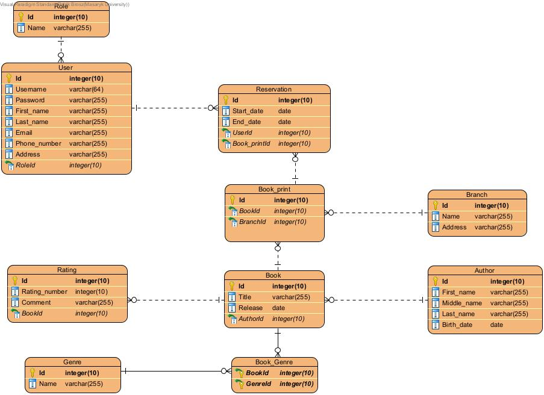

# Library.app

## O projekte

**Autori**:
- 485694 Patrik Brosz (_Blackies_)
- 485630 Richard Ondrejka (_RIK_)
- 468984 Lukáš Hasik (_Ultrafuk_)  

Aplikácia bude umožňovať:
1. autentizáciu používateľov
2. zobraziť ponuku kníh 
3. vyhľadávanie na základe parametrov (názov, autor, žáner, hodnotenie)
4. *používateľovi:*
   1. si zmeniť osobné údaje
   2. managovat rezerváciu na knihu, ktorú by si chcel prečítať
   3. managovat hodnotenia na knihy
   4. zobraziť históriu rezervácií
   5. zobraziť stav knihy (počet dostupných výtlačkov v jednotlivých pobočkách)
5. *adminovi:*
   1. pridávať/mazať/upravovať knihy, užívateľov
   2. managovat rezervacie
   3. managovat pobočky
   4. managovat žánre 
   5. managovat autorov
   6. managovat hodnotenia

Aplikácia je dostupná na adrese: [libapp](https://libapp-pv179.azurewebsites.net/) 
 
Odkaz na aplikáciu: https://libapp-pv179.azurewebsites.net/  
Prihlasovacie údaje pre admina: 
username: Admin 
password: Heslo_je_123 
 

Prihlasovacie údaje pre basic usera: 
username: Ricko48 
password: Heslo_je_123 

---
### ERD

